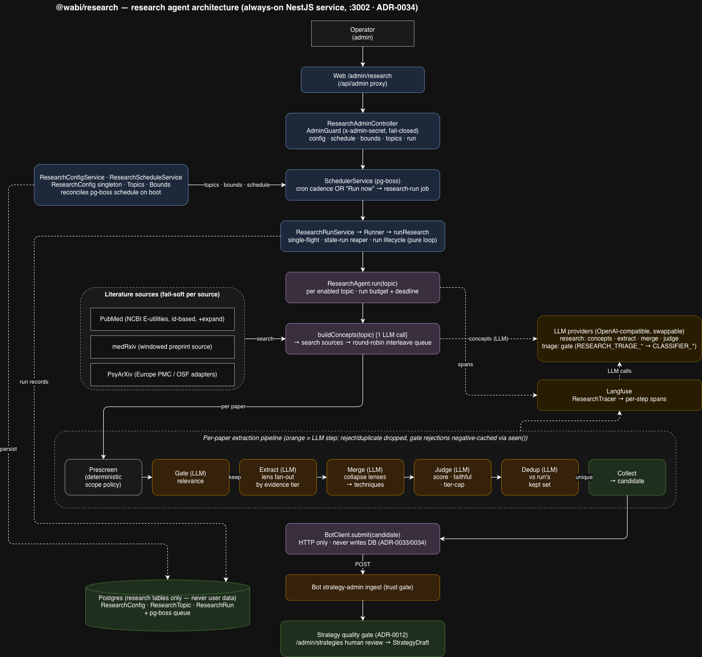

# @wabi/research

An **always-on NestJS service** that mines the published literature for evidence-based
wellbeing techniques and submits them to the bot as `StrategyDraft`s for human review. It runs
as its own HTTP process on **:3002** (ADR-0034), owns its research config/schedule/run history
in the database, and runs the agent on a pg-boss cadence the operator controls from
`/admin/research`.

It produces *candidates*, never live strategies: everything it submits lands behind the bot's
strategy quality gate (ADR-0012) and the `/admin/strategies` human-review surface, reached only
over HTTP (`BotClient`). The worker's DB access is scoped to its own research tables — it never
touches user data or writes `StrategyDraft` directly (ADR-0033 amended / ADR-0034).

## Architecture



## What it does

```
schedule (pg-boss cron) OR "Run now" ─→ research-run job
  load enabled topics + run bounds from the DB (ResearchConfig / ResearchTopic)
  for each topic, under a run budget:
    search PubMed + Europe PMC + PsyArXiv ─→ skip already-seen sources (BotClient.seen)
      ─→ relevance gate (LLM) ─→ extract technique + evidence (LLM) ─→ in-run dedup
      ─→ BotClient.submit(candidate)  ── POST to the bot's strategy-admin ingest (trust gate)
  finalize the ResearchRun row: submitted | deduped | rejected | errors | collected | tokens | topics
```

The run core (`runResearch` in `src/run.ts`) is pure and dependency-injected, so the LLM,
sources, and bot client are all mocked in tests. `ResearchRunnerService` wires the real
implementations and is invoked by the `research-run` consumer.

## Nest layout (`src/`)

- `main.ts` / `app.module.ts` — bootstrap; `ConfigModule.forRoot` loads the root `.env`
  (non-Nest callers such as scripts use `util/load-env.ts` directly).
- `research.module.ts` — wires the services + admin controller + guard, and imports
  `SchedulerModule`.
- `config-service/` — `ResearchConfigService`: owns the `ResearchConfig` singleton +
  `ResearchTopic` list; idempotent boot seed; topic CRUD; bounds validation/persist;
  `getEnabledTopics()` (the runner read).
- `cron-compile/` — pure cadence⇄cron + cron validation module.
- `schedule-service/` — `ResearchScheduleService`: reconciles the pg-boss schedule from the
  persisted config and re-asserts it on boot.
- `run-service/` — `ResearchRunService` (the `research-run` consumer: single-flight, stale-run
  reaper, run-record lifecycle) and `ResearchRunnerService` (wraps `runResearch`).
- `scheduler/` — `SchedulerService`: the thin pg-boss wrapper (start/work/send/schedule/
  unschedule), fail-closed/degraded (no DB → no-op), ported from the bot.
- `admin/` — `ResearchAdminController` (the `/admin/research/*` HTTP surface) + `AdminGuard`
  (`x-admin-secret`, fail-closed).
- `run.ts` — the pure `runResearch` loop (budget/deadline enforcement, outcome tally).
- `config.ts` — `loadBounds()` defaults (now demoted to the DB seed defaults).
- `seed-topics.ts` — the initial topic list seeded into `ResearchTopic` on first boot.
- `bot-client.ts` — HTTP client to the bot: `seen(id)` and `submit(candidate)` (maps HTTP
  status → `submitted | deduped | rejected | error`).
- `sources/` — each adapter implements the uniform `Source` interface (`source.ts`, ADR-0036)
  and owns its own id keyspace (`PMID:` / `doi:` / `osf:`): `pubmed.ts` (NCBI E-utilities +
  BioC/Europe PMC full text, id-based thin papers — hydrate before the gate), `europepmc.ts`
  (Europe PMC search, complete papers), `psyarxiv.ts` (OSF API v2 preprints). `pdf.ts` is the
  shared fetch+parse (with an optional local archive). `query/` turns a topic into search
  concepts via the gate model and renders them into each source's query syntax — server-side
  topical search (ADR-0039). Fixture-backed tests.
- `agent/` — the LLM pipeline: `relevance-gate.ts`, `extract.ts` / `extract-with-lenses.ts`
  (+ `lenses.ts`), `merge-within-paper.ts`, `judge.ts`, `dedup.ts`, `scope-policy.ts`
  (ADR-0041), `research-generate.ts`, and `research-tracer.ts`, orchestrated by
  `research-agent.ts`.
- `evals/` — offline per-step prompt experiments (`gate-metrics.ts`); prompts are evaluated by
  per-step offline experiments rather than only end-to-end (ADR-0040).
- `types.ts` — shared `Paper` / `SourceKind` / `EvidenceTier` / candidate types.
- `util/` — `load-env.ts`, `logger.ts`, `rate-limiter.ts`.

## Admin HTTP surface (behind `AdminGuard`, reached via the web `/api/admin/research` proxy)

`GET config` · `PUT schedule` · `PUT bounds` · `POST topics` · `PATCH topics/:id` ·
`DELETE topics/:id` · `POST run` (Run now) · `GET runs`.

## Running

```bash
pnpm dev                         # nest start --watch on :3002 (joins root `pnpm dev`)
pnpm start:prod                  # node dist/main (built service)
pnpm test                        # jest
pnpm build                       # tsc
```

The service starts degraded when Postgres/pg-boss is down (schedule/run ops no-op); schedules and run history are DB-backed and survive restarts.

## Configuration (env)

Reads the canonical root `.env`. Relevant vars:

- **Service** — `RESEARCH_PORT` (default 3002), `RESEARCH_TZ` (cron timezone, default `UTC`),
  `DATABASE_URL` (research tables + pg-boss queue only).
- **LLM providers** — `RESEARCH_*` (role `research`) for the extract/main model and
  `RESEARCH_TRIAGE_*` (role `research-triage`, falls back to `CLASSIFIER_*`) for the gate.
- **Strategy ingest** — `STRATEGY_API_URL` (the configurable seam; falls back to `BOT_BASE_URL`,
  default `http://localhost:3001`) and `ADMIN_API_SECRET`.
- **Sources** — auth: `NCBI_API_KEY` (PubMed), `OSF_TOKEN` (optional PsyArXiv/OSF, raises the
  anonymous rate limit). Tuning is **shared** across the windowed preprint sources (medRxiv,
  PsyArXiv) via `config.ts` → `loadSourceConfig`: set the shared `RESEARCH_<KEY>` and override one
  source with `RESEARCH_<SOURCE>_<KEY>`. Keys (defaults): `WINDOW_DAYS` (60), `MAX_RECORDS` (1500),
  `MIN_TERM_FRACTION` (0.5), `MAX_PDF_BYTES` (20MB), `MAX_TEXT_CHARS` (50000). `MAX_TEXT_CHARS` also
  caps PubMed BioC/Europe PMC full text (`sourceMaxTextChars`). e.g. `RESEARCH_MAX_PDF_BYTES` for all,
  `RESEARCH_PSYARXIV_MAX_PDF_BYTES` to override just PsyArXiv.
- **Run bounds** — the `RESEARCH_MAX_*` vars are now **seed defaults only**; once the worker has
  booted, the `ResearchConfig` singleton (editable from `/admin/research`) is the source of truth.

See `../../docs/adr/0034-research-worker-topology.md`, `../../docs/adr/0012-strategy-quality-gate.md`,
and `../../docs/ARCHITECTURE.md` for the topology and how submitted drafts flow into review.
